# 🚀 AI Interview Preparation Platform

## 📌 Overview

AI Interview Preparation Platform is a full-stack MERN application that helps users practice technical interviews, analyze resumes, and track interview performance through a modern SaaS-style dashboard.

Built using React.js, Node.js, Express.js, MongoDB, Redux Toolkit, and Tailwind CSS.

---

# ✨ Features

- ✅ JWT Authentication
- ✅ Protected Routes
- ✅ AI Mock Interview Generation
- ✅ Interview Question Flow
- ✅ Answer Submission & Score Calculation
- ✅ Resume Analyzer
- ✅ PDF Resume Upload & Parsing
- ✅ Skill Extraction & Resume Suggestions
- ✅ Dynamic Dashboard Analytics
- ✅ Interview History
- ✅ Responsive SaaS UI
- ✅ Mobile Hamburger Navigation
- ✅ Redux Toolkit State Management
- ✅ Toast Notifications & Error Handling

---

# 🛠️ Tech Stack

## Frontend

- React.js
- Redux Toolkit
- Tailwind CSS
- React Router DOM
- Axios

## Backend

- Node.js
- Express.js
- MongoDB
- Mongoose
- JWT Authentication
- Multer
- pdf-parse
- REST API

---

# 📂 Project Structure

```
AI-Interview-Preparation-Platform/

├── frontend/
│   ├── src/
│   ├── components/
│   ├── pages/
│   └── redux/

├── backend/
│   ├── controllers/
│   ├── routes/
│   ├── models/
│   ├── middleware/
│   └── services/
```

---

# ⚙️ Installation

## Clone Repository

```bash
git clone https://github.com/Jeya-0309/Ai-Interview-Preparation-Platform.git
```

## Frontend Setup

```bash
cd frontend
npm install
npm run dev
```

## Backend Setup

```bash
cd backend
npm install
npm run dev
```

---

# 🔐 Environment Variables

Create `.env` inside backend folder:

```env
PORT=5000

MONGO_URI=YOUR_MONGODB_URL

JWT_SECRET=YOUR_SECRET

OPENAI_API_KEY=YOUR_OPENAI_KEY
```

---

# 📸 Screenshots
### signup Page

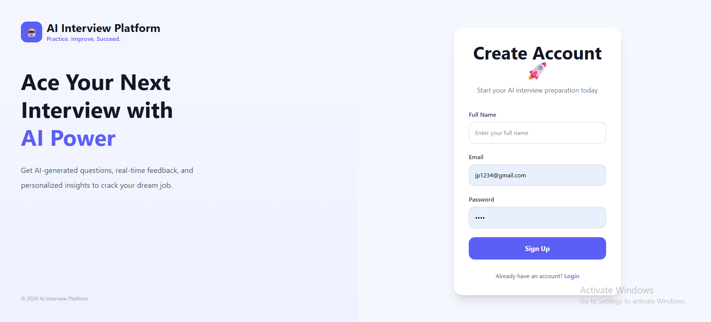

---

### Login Page

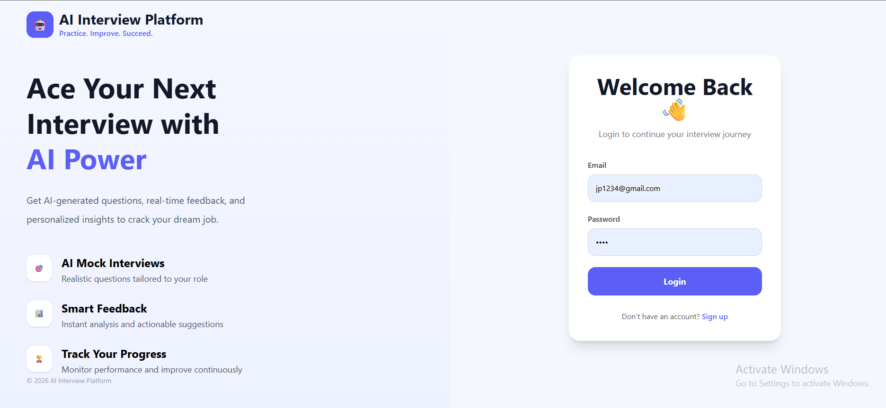

---

### Dashboard

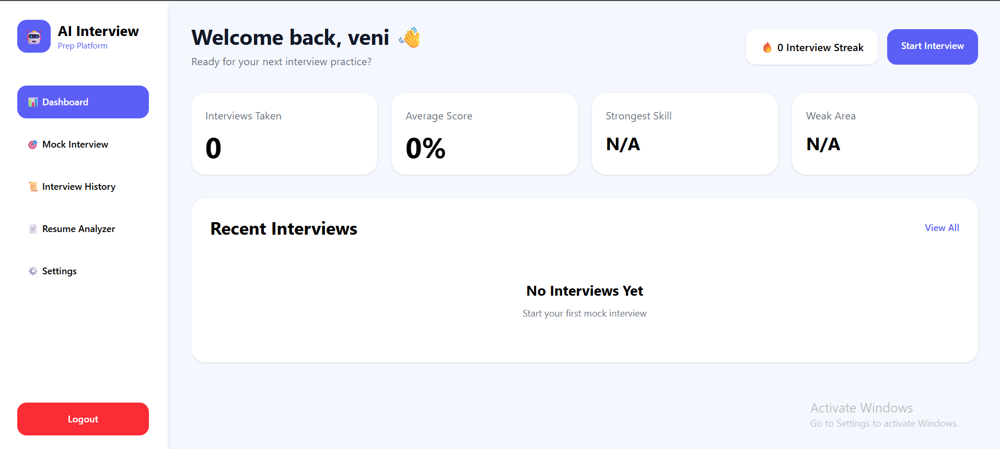

---

### Mock Interview

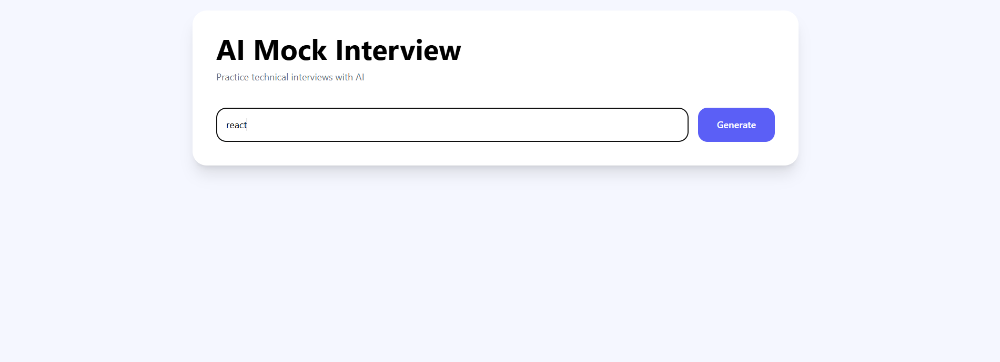

---
###  Interview History

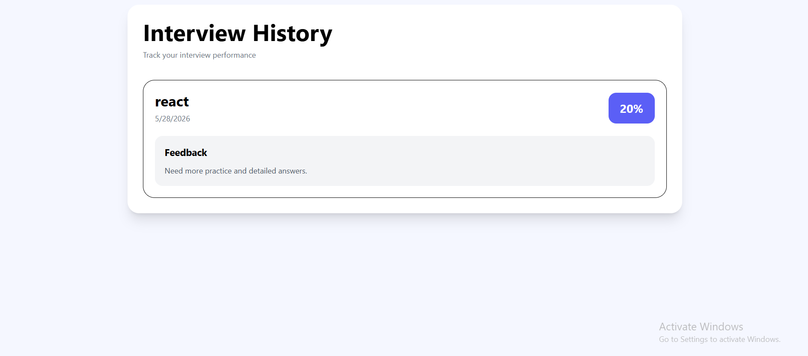

---
###  Interview score

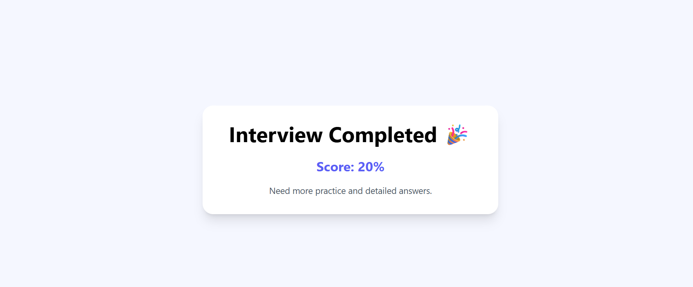

---

### Resume Analyzer

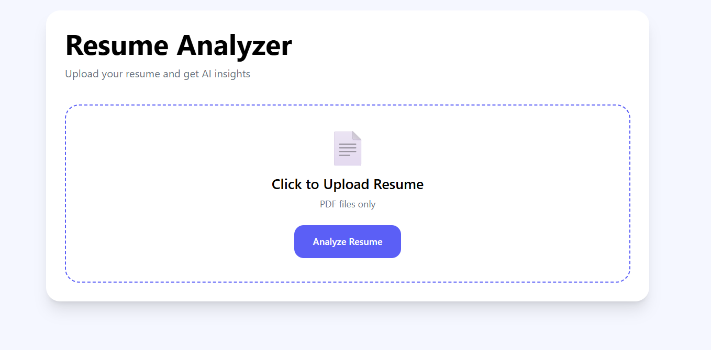

---

### Resume score

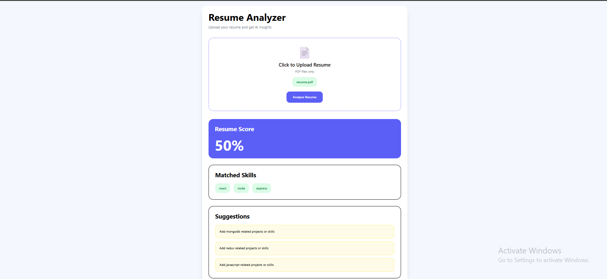

---

### Dashboard Result

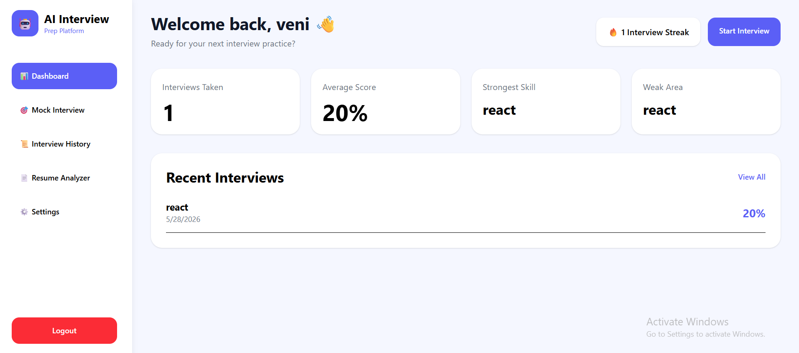

---
### Responsiveness design

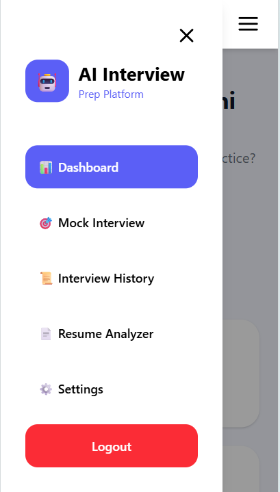

---

### Logout Page

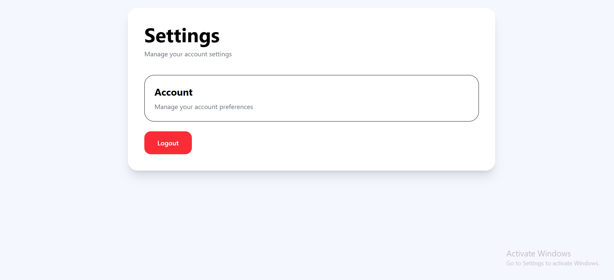

---

# 🌟 Future Improvements

- AI Voice Interview
- Real-time Interview Analysis
- Leaderboard System
- Advanced Resume Scoring
- Admin Dashboard

---

# 👨‍💻 Author

### Jeyapriya

GitHub:
https://github.com/Jeya-0309
